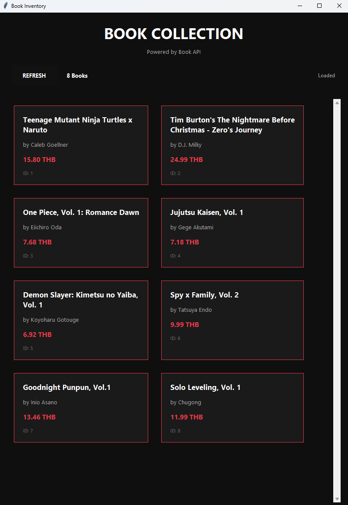

# Book API Desktop Application

แอปพลิเคชัน Desktop ที่ใช้ Tkinter เพื่อแสดงข้อมูลหนังสือจาก Book API โดยมีการออกแบบ UI แบบ Dark Mode พร้อมการแสดงผลในรูปแบบ Grid


## ไฟล์ในโปรเจกต์

- `book.py` - Flask API server ที่ให้บริการข้อมูลหนังสือ
- `my_book_app.py` - Desktop Application พัฒนาด้วย Tkinter
- `requirements.txt` - ไลบรารี Python ที่จำเป็น
- `book_api_result.png` - ภาพหน้าจอผลลัพธ์ของโปรแกรม
- `README.md` - ไฟล์คำแนะนำนี้

## วิธีเริ่มต้นใช้งาน

### 1. ติดตั้ง Dependencies

เปิด PowerShell Terminal และรันคำสั่ง:

```powershell
py -m pip install -r requirements.txt
```

### 2. เปิด Book API Server

รันไฟล์ `book.py` ในเทอร์มินัลที่หนึ่ง:

```powershell
py book.py
```

API จะทำงานที่ `http://127.0.0.1:5001`

### 3. เปิด Desktop Application

เปิด Terminal ใหม่และรันไฟล์ `my_book_app.py`:

```powershell
py my_book_app.py
```

หน้าต่างแอปพลิเคชันจะเปิดขึ้น

## ฟีเจอร์หลัก

### Frontend (Desktop App)
- **Dark Mode UI** - ออกแบบ UI แบบ Dark Theme พร้อมจังหวะเรดการไฮไลท์
- **Grid Layout** - แสดงหนังสือในรูปแบบ Grid (2 คอลัมน์)
- **Book Cards** - แต่ละการ์ดแสดงข้อมูล:
  - ชื่อหนังสือ
  - ผู้แต่ง
  - รูปภาพปก
  - ราคา (แสดงเป็นหลัก THB)


### Backend (Book API)
- **CRUD Operations** - สนับสนุน Create, Read, Update, Delete
- **Endpoints**:
  - `GET /books` - ดึงหนังสือทั้งหมด
  - `GET /books/<id>` - ดึงหนังสือตาม ID
  - `POST /books` - เพิ่มหนังสือใหม่
  - `PUT /books/<id>` - อัปเดตข้อมูลหนังสือ
  - `DELETE /books/<id>` - ลบหนังสือ
- **Sample Data** - มีข้อมูลตัวอย่าง 8 เรื่อง (Anime/Manga)
- **CORS Support** - รองรับการเรียกจากโดเมนอื่น

## โครงสร้างข้อมูลหนังสือ

```json
{
  "id": 1,
  "title": "Book Title",
  "author": "Author Name",
  "image_url": "https://...",
  "price": 15.99
}
```

## วิธีการทำงานของโปรแกรม

1. เปิด API Server เพื่อให้บริการข้อมูลหนังสือ
2. เปิด Desktop App ที่จะเชื่อมต่อไปยัง API
3. คลิกปุ่ม "Load Books" เพื่อดึงข้อมูลหนังสือจาก API
4. หนังสือจะแสดงผลในรูปแบบ Cards ในหน้าต่าง

## ภาพหน้าจอผลลัพธ์



---

หมายเหตุ: โปรแกรมนี้เป็นโครงการเพื่อการศึกษาและแสดงการใช้งาน Flask API กับ Tkinter GUI
